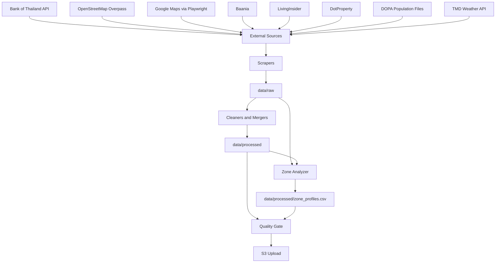
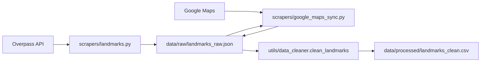
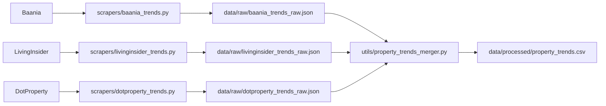
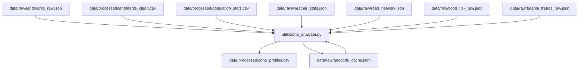

# Architecture and Data Flow

เอกสารนี้สรุปสถาปัตยกรรมของโปรเจก `ai_web_scrpping` สำหรับใช้เป็นฐานร่วมของทีมในการพัฒนาต่อ, debug pipeline, และคุยเรื่อง data contract ให้ตรงกัน

อัปเดตจากโค้ดใน repo ณ วันที่ `2026-05-15`

## 1. เป้าหมายของระบบ

โปรเจกนี้เป็น data pipeline สำหรับสร้าง `location intelligence` และ `property market intelligence` ของ 10 จังหวัดในไทย โดยรวมข้อมูลจากหลายแหล่งแล้วสรุปออกมาเป็นชุดข้อมูลพร้อมใช้งาน

ผลลัพธ์หลักที่ระบบต้องการสร้าง:

- `data/processed/property_trends.csv`
- `data/processed/landmarks_clean.csv`
- `data/processed/zone_profiles.csv`
- `data/processed/bank_loans_clean.csv`

## 2. ขอบเขตข้อมูล

ระบบพยายามรวมข้อมูล 4 เสาหลัก:

1. `Property trends`
   ราคาอสังหาฯ จาก `Baania`, `LivingInsider`, `DotProperty`
2. `Landmarks / POI`
   จุดสำคัญเชิงพื้นที่จาก `OpenStreetMap` และ `Google Maps`
3. `Area context`
   ข้อมูลถนน, น้ำท่วม, อากาศ, ประชากร
4. `Scoring / zone intelligence`
   การสรุปแต่ละ anchor area ให้ออกมาเป็น zone profile

## 3. Entry Points

### 3.1 `main.py`

ไฟล์ [main.py](/C:/ai_web_scrpping/main.py:19) เป็น full pipeline ระดับ repo root

ลำดับที่ตั้งใจให้ทำงาน:

1. scrape bank loans
2. scrape property trends
3. scrape landmarks
4. enrich landmarks ด้วย Google Maps
5. clean / merge ข้อมูล
6. analyze zones
7. validate outputs
8. upload processed files ไป S3

หมายเหตุ:

- ใช้รันจาก repo root ด้วย `python main.py`
- มี S3 upload ใน flow
- ตอนนี้ในโค้ดมี mismatch ระหว่างชื่อฟังก์ชันที่ import กับชื่อฟังก์ชันจริงใน scraper

### 3.2 `run_zones_only.py`

ไฟล์ [run_zones_only.py](/C:/ai_web_scrpping/run_zones_only.py:21) เป็น micro-zone pipeline ที่เน้นฝั่ง spatial/context มากกว่า full ETL

ลำดับที่ตั้งใจให้ทำงาน:

1. scrape population
2. scrape weather
3. scrape landmarks ถ้ายังไม่มี raw
4. scrape road network
5. enrich landmarks ด้วย Google Maps
6. clean landmarks
7. analyze zones
8. validate outputs

หมายเหตุ:

- ตัวชื่อไฟล์ทำให้เข้าใจว่าเป็น "zones only" แต่จริง ๆ มีการ scrape population, weather, roads ด้วย
- มีการรวม Pipeline ย่อยและการตรวจสอบ Data Quality ไว้ครบถ้วน

## 4. High-Level Architecture



## 5. Module Map

### 5.1 Scrapers

- [scrapers/bank_loans.py](/C:/ai_web_scrpping/scrapers/bank_loans.py:1)
  ดึง base loan rates จาก BOT API
- [scrapers/landmarks.py](/C:/ai_web_scrpping/scrapers/landmarks.py:1)
  ดึง POI จาก Overpass API แบ่งเป็น Layer 1/2/3
- [scrapers/google_maps_sync.py](/C:/ai_web_scrpping/scrapers/google_maps_sync.py:1)
  enrich และ discover POI เพิ่มจาก Google Maps
- [scrapers/road_analysis.py](/C:/ai_web_scrpping/scrapers/road_analysis.py:1)
  คำนวณ road complexity รอบ anchor
- [scrapers/baania_trends.py](/C:/ai_web_scrpping/scrapers/baania_trends.py:1)
  ดึง listing ราคาและสรุป median ระดับ tambon
- [scrapers/livinginsider_trends.py](/C:/ai_web_scrpping/scrapers/livinginsider_trends.py:1)
  ดึง listing ราคาแบบ heuristic
- [scrapers/dotproperty_trends.py](/C:/ai_web_scrpping/scrapers/dotproperty_trends.py:1)
  ดึง listing ราคาแบบ HTML scrape
- [scrapers/population_dopa.py](/C:/ai_web_scrpping/scrapers/population_dopa.py:1)
  ดึงประชากรระดับ district/tambon
- [scrapers/weather_data.py](/C:/ai_web_scrpping/scrapers/weather_data.py:1)
  ดึง weather จาก TMD API
- `scrapers/flood_risk.py`
  ดึงข้อมูลพื้นที่เสี่ยงน้ำท่วม
- `scrapers/setup_districts_v5.py` / `scrapers/setup_tambons.py`
  ดึงและสร้างฐานข้อมูลโครงสร้างอำเภอ/ตำบลเบื้องต้น

### 5.2 Utils

- [utils/data_cleaner.py](/C:/ai_web_scrpping/utils/data_cleaner.py:1)
  clean bank loans และ dedup landmarks
- [utils/property_trends_merger.py](/C:/ai_web_scrpping/utils/property_trends_merger.py:1)
  รวม property trends หลายแหล่งเป็น canonical output
- [utils/zone_analyzer.py](/C:/ai_web_scrpping/utils/zone_analyzer.py:63)
  สร้าง zone profiles และ strategic score
- [utils/pipeline_quality.py](/C:/ai_web_scrpping/utils/pipeline_quality.py:13)
  ตรวจความครบของ outputs
- [utils/aws_uploader.py](/C:/ai_web_scrpping/utils/aws_uploader.py:1)
  upload processed files ไป S3
- `utils/district_lookup_creator.py` / `utils/preprocess_target_boundaries.py`
  ประมวลผลข้อมูลขอบเขตพื้นที่ให้พร้อมใช้งาน
- `utils/quick_verify.py`
  สคริปต์สั้นสำหรับตรวจสอบข้อมูลเฉพาะจุด

## 6. Detailed Data Flow

### 6.1 Landmarks Flow



คำอธิบาย:

- `landmarks.py` เป็นตัวสร้างชุด POI ตั้งต้นจาก OSM
- `google_maps_sync.py` อ่าน `landmarks_raw.json` เดิม, เติม POI ใหม่, แล้วเขียนทับไฟล์เดิม
- `clean_landmarks()` dedup และ normalize ก่อนส่งออกเป็น CSV

### 6.2 Property Trends Flow



คำอธิบาย:

- แต่ละ source สร้าง raw JSON ของตัวเอง
- `property_trends_merger.py` normalize จังหวัดและประเภทอสังหาฯ แล้ว aggregate เป็น canonical CSV
- output ที่ทีม downstream ควรยึดคือ `data/processed/property_trends.csv`

### 6.3 Zone Intelligence Flow



คำอธิบาย:

- `zone_analyzer.py` ใช้ Layer 1 landmark เป็น anchor หลัก
- reverse geocode ตำแหน่ง anchor ด้วย Nominatim และ cache ลง `geocode_cache.json`
- คำนวณ POI score, road score, flood penalty, population-related features
- เขียนออกเป็น `zone_profiles.csv`

## 7. Data Storage Layout

### 7.1 `data/raw/`

เก็บข้อมูลดิบจาก scraper หรือ intermediate files ที่ยังไม่ผ่าน standardization เต็มรูปแบบ

ไฟล์สำคัญ:

- `bank_loans_raw.json`
- `baania_trends_raw.json`
- `baania_trends_raw_raw_listings.json`
- `livinginsider_trends_raw.json`
- `dotproperty_trends_raw.json`
- `landmarks_raw.json`
- `road_network.json`
- `weather_stats.json`
- `flood_risk_raw.json`
- `geocode_cache.json`
- `local_iconic_targets.json`

### 7.2 `data/processed/`

เก็บ canonical outputs สำหรับ downstream use

ไฟล์สำคัญ:

- `bank_loans_clean.csv`
- `property_trends.csv`
- `landmarks_clean.csv`
- `population_stats.csv`
- `zone_profiles.csv`

## 8. Data Contracts

ส่วนนี้เป็นสัญญาระดับทีมว่าคน downstream ควรคาดหวังอะไรจากแต่ละไฟล์

### 8.1 `data/raw/landmarks_raw.json`

คาดว่าเป็น `list[object]` โดยแต่ละ record ควรมีอย่างน้อย:

- `province`
- `province_en`
- `name`
- `category`
- `layer`
- `layer_name`
- `lat`
- `lon`
- `source`

แหล่งที่มา:

- `OpenStreetMap / Overpass API`
- `Google Maps`

ข้อสังเกต:

- ไฟล์นี้ถูกเขียนทับหลัง enrich ด้วย Google Maps
- ใช้เป็น input หลักของทั้ง `clean_landmarks()` และ `zone_analyzer.py`

### 8.2 `data/processed/landmarks_clean.csv`

คาดว่ามีคอลัมน์หลัก:

- `province`
- `province_en`
- `name`
- `name_en`
- `category`
- `layer`
- `layer_name`
- `lat`
- `lon`
- `source`

บทบาท:

- เป็น cleaned view ของ landmarks
- ใช้เป็น source สำหรับ Layer 1 anchors ใน `zone_analyzer.py`

### 8.3 `data/processed/property_trends.csv`

คาดว่ามีคอลัมน์หลัก:

- `province`
- `property_type`
- `median_price`
- `total_samples`
- `source_count`
- `sources`

บทบาท:

- เป็น canonical market trends output ระดับจังหวัด
- downstream ควรอิงไฟล์นี้แทน raw trend files

### 8.4 `data/processed/population_stats.csv`

คาดว่ามีคอลัมน์หลัก:

- `province_name`
- `district_name`
- `tambon_name`
- `is_tambon`
- `total_population`
- `male`
- `female`
- `age_children`
- `age_working`
- `age_elderly`

บทบาท:

- ใช้เป็น fallback ได้ทั้งระดับ district และ tambon

### 8.5 `data/raw/weather_stats.json`

คาดว่าเป็น `dict` keyed by province name และ value มีข้อมูลเช่น:

- `max_temp_2023`
- `min_temp_2023`
- `max_rain_2023`
- `avg_temp`
- `annual_rainfall`
- `data_source`

### 8.6 `data/raw/road_network.json`

คาดว่าเป็น `list[object]` โดยแต่ละ record มี:

- `zone_anchor`
- `lat`
- `lon`
- `total_road_segments`
- `primary_road_count`
- `road_node_density`
- `road_complexity_score`

### 8.7 `data/processed/zone_profiles.csv`

คาดว่ามีคอลัมน์หลัก:

- `province`
- `district`
- `tambon`
- `zone_name`
- `lat`
- `lon`
- `landmark_total_score`
- `landmark_layer1_count`
- `landmark_layer2_count`
- `landmark_layer3_count`
- `landmark_nearby_names`
- `landmark_amenity_json`
- `road_connectivity_index`
- `area_weather_max_temp`
- `area_flood_risk_level`
- `area_flood_penalty_score`
- `pop_total_density`
- `pop_working_age_ratio`
- `pop_estimated_monthly_income`
- `pop_dominant_occupation`
- `strategic_score`
- `zone_grade`

บทบาท:

- เป็น final analytical output ของ spatial intelligence layer

## 9. Quality Gate

ไฟล์ [utils/pipeline_quality.py](/C:/ai_web_scrpping/utils/pipeline_quality.py:13) ตรวจ 3 เรื่องหลัก:

1. landmarks ต้องมีครบ 10 จังหวัด และแต่ละจังหวัดต้องมี Layer 1/2/3
2. property trends ต้องมีครบ 10 จังหวัด และมี `House`, `Condo`, `Land`, `Townhouse`
3. จำนวนแถวใน `zone_profiles.csv` ต้องเท่ากับจำนวน Layer 1 anchors

ข้อจำกัด:

- quality gate ยังเน้นความครบเชิงรูปแบบมากกว่าความถูกต้องเชิงธุรกิจ
- ยังไม่เช็ก distribution ผิดปกติ, duplicated anchors, หรือ score outliers

## 10. External Dependencies

### 10.1 Python runtime

- repo ใช้ Python `3.13` ตาม `venv/pyvenv.cfg`

### 10.2 Playwright

จำเป็นสำหรับ:

- `scrapers/google_maps_sync.py`
- `scrapers/livinginsider_trends.py`
- `scrapers/baania_trends.py`

ถ้า browser binaries ยังไม่พร้อม:

```bash
python -m playwright install chromium
```

### 10.3 Environment variables

- `BOT_API_KEY`
  ใช้โดย `scrapers/bank_loans.py`

### 10.4 AWS credentials

จำเป็นเมื่อใช้ S3 upload ใน `main.py`

### 10.5 Networked APIs / sites

- BOT API
- Overpass API mirrors
- Google Maps
- DOPA stat files
- TMD API
- listing sites ของแต่ละ property portal
- Nominatim reverse geocoding

## 11. Operational Notes

### 11.1 สิ่งที่ควรรู้ก่อนรัน

- ควรรันจาก repo root
- ไม่ควรรัน scraper เดี่ยวผ่าน `if __name__ == "__main__"` ถ้าไฟล์นั้นอ้าง path แบบ `../data/...`
- `google_maps_sync()` เขียนทับ `data/raw/landmarks_raw.json`
- repo ยังไม่มี root `.gitignore`
- ใน working tree มี generated files และ `__pycache__` ปรากฏใน git status ได้

### 11.2 Current processed snapshot

จากไฟล์ใน repo ตอนที่สรุปเอกสารนี้:

- `landmarks_clean.csv` มี `3816` แถว
- `property_trends.csv` มี `40` แถว
- `property_trends.csv` ครบ `10` จังหวัด x `4` ประเภทหลัก
- `zone_profiles.csv` ว่าง `0` แถว

## 12. Known Issues

รายการนี้ตั้งใจให้เป็น working list สำหรับทีม

### 12.1 Function naming mismatch in `main.py`

`main.py` import ฟังก์ชันชื่อ:

- `scrape_dotproperty_trends`
- `scrape_baania_trends`
- `scrape_livinginsider_trends`

แต่ใน scraper ปัจจุบันมีฟังก์ชัน:

- `scrape_dotproperty_micro_trends`
- `scrape_baania_micro_trends`
- `scrape_livinginsider_micro_trends`

ผลกระทบ:

- full pipeline มีโอกาสพังตั้งแต่ import stage

### 12.2 Property trend inputs are not fully used in zone scoring

แม้ `zone_analyzer.py` จะรับ `property_trends_path` และโหลด `micro_price_index`
แต่ฟีเจอร์ราคายังไม่ได้ถูกนำเข้าไปใน output และ `strategic_score` อย่างเป็นระบบ

ผลกระทบ:

- analytical output ยังไม่สะท้อน market layer ตามที่ชื่อระบบบอกไว้เต็มที่

### 12.3 Encoding problems in source files

หลายไฟล์มีข้อความไทยที่แสดงเป็น mojibake

ผลกระทบ:

- ทำให้ maintain ยาก
- เพิ่มความเสี่ยงเวลา debug หรือแก้ logic

## 13. Recommended Team Conventions

เพื่อให้พัฒนาต่อได้ง่ายขึ้น แนะนำให้ทีมถือข้อตกลงต่อไปนี้

### 13.1 Canonical outputs

ให้ downstream jobs, notebooks, dashboards ใช้ไฟล์เหล่านี้เป็นหลัก:

- `data/processed/property_trends.csv`
- `data/processed/landmarks_clean.csv`
- `data/processed/zone_profiles.csv`

### 13.2 Raw files are not stable contracts

ไฟล์ใน `data/raw/` ควรถูกมองว่าเป็น scraper artifacts หรือ intermediates
ไม่ควรให้ consumer ภายนอกพึ่ง schema ตรง ๆ เว้นแต่ระบุชัด

### 13.3 Separate responsibilities

- `scrapers/` ควรมีหน้าที่เก็บข้อมูล
- `utils/data_cleaner.py` และ merger ควรมีหน้าที่ normalize schema
- `zone_analyzer.py` ควรมีหน้าที่ analytical feature engineering และ scoring

### 13.4 Add schema checks before scoring

ก่อนคำนวณ zone score ควร validate input shape ของ:

- flood data
- road data
- population data
- landmarks layer coverage

## 14. Suggested Next Refactor Phases

### Phase 1: Stabilize execution

- แก้ function name mismatch ใน `main.py`
- ทำให้ `zone_profiles.csv` กลับมามีข้อมูลสมบูรณ์ยิ่งขึ้น

### Phase 2: Formalize contracts

- แยก schema ของ raw และ processed files ให้ชัด
- เพิ่ม smoke tests สำหรับ pipeline หลัก
- เพิ่ม error messages ที่ชี้จุดได้ชัดขึ้น

### Phase 3: Improve analytical layer

- นำ property trends เข้า zone scoring แบบ explicit
- แยก scoring weights ออกเป็น config
- เพิ่ม feature provenance ว่าคอลัมน์ไหนมาจาก source ไหน

## 15. Ownership Map ที่แนะนำ

ถ้าจะแบ่งงานในทีม แนะนำแบ่งตาม boundary นี้:

- `Ingestion owner`
  ดูแล `scrapers/`
- `Data contract owner`
  ดูแล schema, cleaner, merger, validation
- `Analytics owner`
  ดูแล `zone_analyzer.py`, scoring, output semantics
- `Operations owner`
  ดูแล environment, Playwright, credentials, S3, scheduling

## 16. สรุปสั้น

ภาพรวมของระบบตอนนี้:

- โจทย์ของโปรเจกชัดและมีคุณค่า
- โครงสร้างหลักแบ่ง scraper / processor / analyzer ถูกทาง
- canonical outputs มีแนวทางแล้ว
- แต่ execution path ยังมี bug เชิงสัญญาและ data shape บางจุด

ถ้าทีมจะพัฒนาต่อ ควรถือเอกสารนี้เป็น baseline แล้วโฟกัส 3 เรื่องก่อน:

1. ทำให้ pipeline รันผ่านจริง
2. ทำ data contract ให้ชัด
3. แยก analytical logic ออกจาก ingestion ให้มากขึ้น
